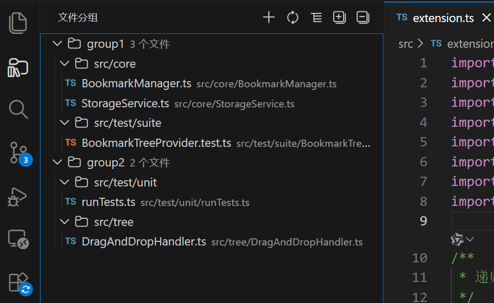

# 📁 File Group Manager

> **Organize your files efficiently and boost your productivity**
> Create custom groups, quick access, and manage your workspace files with ease.

---

## ✨ Features

- **🗂️ Custom Groups** - Organize files into logical groups that match your workflow
- **⚡ Quick Access** - Open any file instantly from the dedicated sidebar panel
- **🎯 Easy Management** - Add, remove, rename groups and files with simple clicks
- **💾 Persistent Storage** - All groups are automatically saved to your workspace
- **🌍 Multi-language** - Full support for English and Chinese
- **🔄 Dual View Modes** - Switch between flat list and tree structure views
- **🖱️ Drag & Drop** - Drag files between groups to reorganize
- **📋 Quick Actions** - Copy file names and relative paths instantly

---

## 📸 Screenshots

### Main Interface

*File Groups panel with organized files and folders*

---

## 🚀 Getting Started

### Installation

1. Open VS Code
2. Press `Ctrl+Shift+X` (Cmd+Shift+X on Mac) to open Extensions
3. Search for `File Group Manager`
4. Click **Install**

### Basic Usage

#### ➕ Create a Group

1. Click the **➕** button in the "File Groups" panel
2. Enter a group name
3. The new group appears in the sidebar

#### 📎 Add Files to a Group

**Method 1: Right-click Menu**
- Right-click on a file in the Explorer
- Select "Add File to Group"
- Choose the target group

**Method 2: Editor Tab**
- Right-click on the editor tab
- Select "Add File to Group"
- Choose the target group

**Method 3: Drag & Drop**
- Drag files from Explorer
- Drop them onto any group

#### 📂 Open Files

Simply click on any file in the "File Groups" panel to open it in the editor.

#### ⚙️ Manage Groups

| Action | Method |
|--------|--------|
| **Rename Group** | Click the ✏️ icon next to the group name |
| **Delete Group** | Click the 🗑️ icon next to the group name |
| **Remove File** | Click the ➖ icon next to the file name |
| **Copy File Name** | Click the 📋 icon to copy the file name |
| **Copy Path** | Click the 📋 icon to copy the relative path |

#### 👁️ View Modes

Toggle between two view modes:
- **Flat View** - Shows all files in a simple list
- **Tree View** - Displays files in a hierarchical folder structure

---

## ⌨️ Keyboard Shortcuts

Open Command Palette (`Ctrl+Shift+P` / `Cmd+Shift+P`) and search for:

| Command | Description |
|---------|-------------|
| `Create Group` | Create a new file group |
| `Add File to Group` | Add current file to a group |
| `Refresh` | Refresh the file groups view |
| `Toggle View Mode` | Switch between flat and tree view |
| `Expand All` | Expand all folders in tree view |
| `Collapse All` | Collapse all folders in tree view |

---

## 📋 Requirements

- **VS Code**: Version 1.85.0 or higher

---

## 🔧 Extension Settings

This extension does not add any VS Code settings. All data is stored in your workspace:

- Groups are saved in `.vscode/file-groups.json`
- Each workspace has its own independent groups
- Groups are automatically synced when you switch workspaces

---

## 🎯 Use Cases

- **Project Navigation** - Quick access to frequently used files
- **Task-Based Organization** - Group files by feature, task, or sprint
- **Code Review** - Organize files that need review together
- **Learning** - Group tutorial or example files
- **Documentation** - Keep related docs and config files together

---

## 📝 Release Notes

### 🎉 1.0.0 (Stable Release)

- ✨ Group Management - Create, delete, and rename file groups
- 📁 File Operations - Add, remove files with drag & drop support
- 🔄 Dual View Modes - Toggle between flat view and tree view
- 📋 Quick Actions - Copy file names and relative paths
- 🌍 Multi-language - Full English and Chinese support
- 🖱️ Context Menu Integration - Right-click menus in explorer and editor
- 🎨 Enhanced UI - Modern icons and improved visual feedback

See [CHANGELOG.md](CHANGELOG.md) for detailed release notes.

---

## 🤝 Contributing

Contributions are welcome! Please feel free to:

1. Report bugs via [GitHub Issues](https://github.com/Yealove/file-groups/issues)
2. Suggest new features
3. Submit pull requests

---

## 📄 License

[MIT](LICENSE) - Feel free to use this extension in your projects!

---

## 💖 Support

If you find this extension helpful, please consider:

- ⭐ Rating it on the [VSCode Marketplace](https://marketplace.visualstudio.com/items?itemName=yealove.file-group-manager)
- 🐛 Reporting issues to help improve it
- 💬 Sharing feedback and suggestions

---

**Made with ❤️ by [Yealove](https://github.com/Yealove)**

---

---

# 📁 文件分组管理器

> **高效组织您的文件，提升工作效率**
> 创建自定义分组，快速访问，轻松管理工作区文件。

---

## ✨ 功能特性

- **🗂️ 自定义分组** - 按工作流逻辑组织文件
- **⚡ 快速访问** - 从专用侧边栏面板即时打开任何文件
- **🎯 简单管理** - 点击即可添加、删除、重命名分组和文件
- **💾 持久化存储** - 所有分组自动保存到工作区
- **🌍 多语言** - 完整的中文和英文支持
- **🔄 双视图模式** - 扁平列表和树形结构视图一键切换
- **🖱️ 拖拽功能** - 拖拽文件在分组间移动
- **📋 快捷操作** - 即时复制文件名和相对路径

---

## 🚀 快速开始

### 安装

1. 打开 VS Code
2. 按 `Ctrl+Shift+X` (Mac 上按 `Cmd+Shift+X`) 打开扩展面板
3. 搜索 `File Group Manager`
4. 点击 **安装**

### 基本使用

#### ➕ 创建分组

1. 点击"文件分组"面板中的 **➕** 按钮
2. 输入分组名称
3. 新分组出现在侧边栏中

#### 📎 添加文件到分组

**方法一：右键菜单**
- 在资源管理器中右键点击文件
- 选择"添加文件到分组"
- 选择目标分组

**方法二：编辑器标签**
- 右键点击编辑器标签
- 选择"添加文件到分组"
- 选择目标分组

**方法三：拖拽**
- 从资源管理器拖拽文件
- 放置到任意分组上

#### 📂 打开文件

在"文件分组"面板中点击任意文件即可在编辑器中打开。

#### ⚙️ 管理分组

| 操作 | 方法 |
|------|------|
| **重命名分组** | 点击分组名称旁的 ✏️ 图标 |
| **删除分组** | 点击分组名称旁的 🗑️ 图标 |
| **移除文件** | 点击文件名旁的 ➖ 图标 |
| **复制文件名** | 点击 📋 图标复制文件名 |
| **复制路径** | 点击 📋 图标复制相对路径 |

#### 👁️ 视图模式

在两种视图模式间切换：
- **扁平视图** - 以简单列表显示所有文件
- **树形视图** - 以分层文件夹结构显示文件

---

## ⌨️ 命令面板

打开命令面板 (`Ctrl+Shift+P` / `Cmd+Shift+P`) 并搜索：

| 命令 | 描述 |
|------|------|
| `创建分组` | 创建新的文件分组 |
| `添加文件到分组` | 将当前文件添加到分组 |
| `刷新` | 刷新文件分组视图 |
| `切换视图模式` | 在扁平和树形视图间切换 |
| `全部展开` | 展开树形视图中的所有文件夹 |
| `全部折叠` | 折叠树形视图中的所有文件夹 |

---

## 📋 系统要求

- **VS Code**: 1.85.0 或更高版本

---

## 🔧 扩展设置

此扩展不添加任何 VS Code 设置。所有数据存储在您的工作区中：

- 分组保存在 `.vscode/file-groups.json`
- 每个工作区都有独立的分组
- 切换工作区时自动同步分组

---

## 🎯 使用场景

- **项目导航** - 快速访问常用文件
- **任务组织** - 按功能、任务或迭代组织文件
- **代码审查** - 将需要审查的文件组织在一起
- **学习整理** - 分组教程或示例文件
- **文档管理** - 保存相关的文档和配置文件

---

## 📝 发布说明

### 🎉 1.0.0 (稳定版)

- ✨ 分组管理 - 创建、删除和重命名文件分组
- 📁 文件操作 - 添加、移除文件，支持拖拽
- 🔄 双视图模式 - 扁平视图和树形视图切换
- 📋 快捷操作 - 复制文件名和相对路径
- 🌍 多语言 - 完整的中文和英文支持
- 🖱️ 右键菜单 - 资源管理器和编辑器集成
- 🎨 增强界面 - 现代图标和视觉反馈

详细发布说明请参阅 [CHANGELOG.md](CHANGELOG.md)。

---

## 🤝 贡献

欢迎贡献！请随时：

1. 通过 [GitHub Issues](https://github.com/Yealove/file-groups/issues) 报告问题
2. 提出新功能建议
3. 提交 Pull Request

---

## 📄 许可证

[MIT](LICENSE) - 在您的项目中自由使用！

---

## 💖 支持

如果您觉得这个扩展有帮助，请考虑：

- ⭐ 在 [VSCode Marketplace](https://marketplace.visualstudio.com/items?itemName=yealove.file-group-manager) 上评分
- 🐛 报告问题帮助改进
- 💬 分享反馈和建议

---

**由 [Yealove](https://github.com/Yealove) 用 ❤️ 制作**
